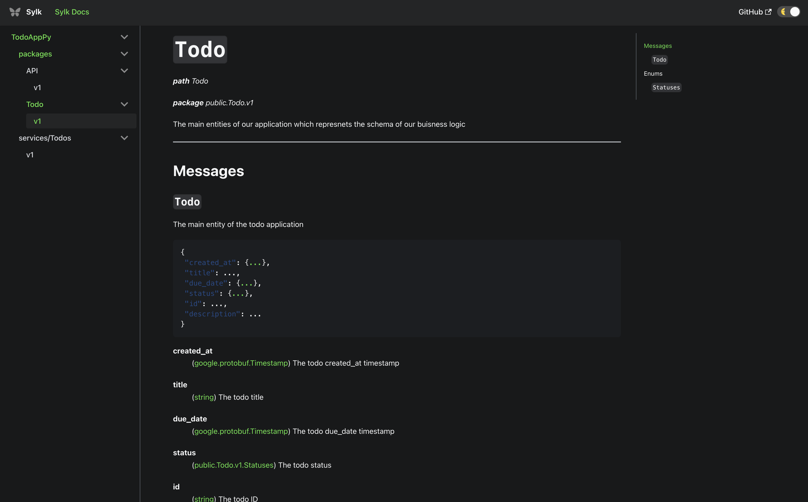

# Docusaurus Sylk Plugin

This is the root project repository for sylk's autogenerated docs plugin used with docusaurus.

For more details on usage see [docusaurus-sylk-plugin](/packages/docusaurus-sylk-plugin/README.md)

#### Visit the [landing page](https://sylk.build/) for sylk documentation.

[Docusaurus](https://docusaurus.io/) toolset for Protobuf contract documentation. Provides a set of components and MDX doc file generators for Docusaurus sites.

## Usage

See [`docusaurus-sylk`](https://github.com/sylk/docusaurus-sylk/tree/master/packages/docusaurus-sylk#usage) for details on usage.

See [`docusaurus-sylk-init`](https://github.com/sylk/docusaurus-sylk/tree/master/packages/docusaurus-sylk-init#usage) to create a new Docusaurus project with this toolset installed.

## Features
### Existing
- React components for documenting Protobuf file descriptors including messages, services, and enums.
- Markdown doc (mdx) generation for the [Docusaurus platform](https://docusaurus.io/).
- Docusaurus sidebar object generation for a complete documentation workspace.

### Demo

<!--  -->
<!--  -->

Visit the [documentation site](https://docs.sylk.build/).

## Packages

### [`docusaurus-sylk`](https://github.com/sylk-build/docusaurus-sylk/tree/master/packages/docusaurus-sylk)

Docusaurus preset to help mount the plugin and render all generated files.

### [`docusaurus-sylk-init`](https://github.com/sylk-build/docusaurus-sylk/tree/master/packages/docusaurus-sylk-init)

Docusaurus project generator to scaffold a new site with these packages installed in a recommended setup.

### [`docusaurus-sylk-plugin`](https://github.com/sylk-build/docusaurus-sylk/tree/master/packages/docusaurus-sylk-plugin)

Docusaurus plugin containing the CLI commands, file generators, and components.

## Contributing

Contributions, issues and feature requests are always welcome!

---
This plugin created with ❤️ by [Sylk team](https://sylk.build/)
